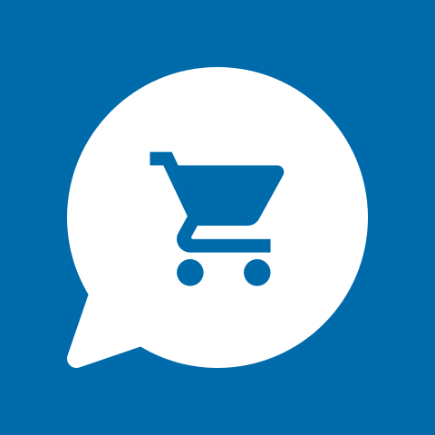
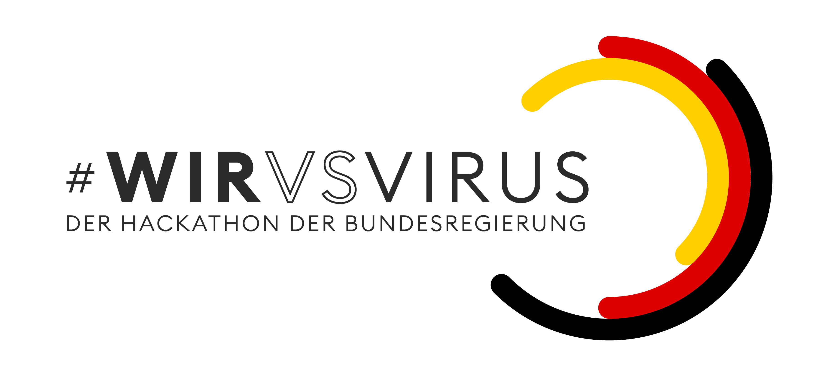
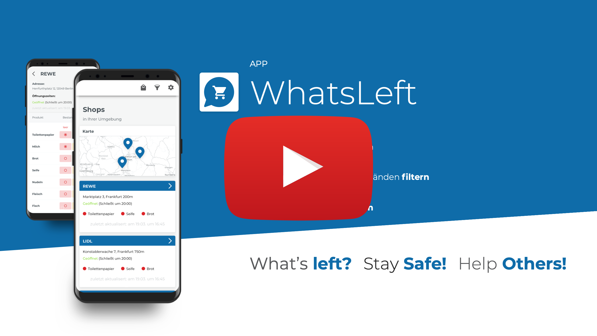
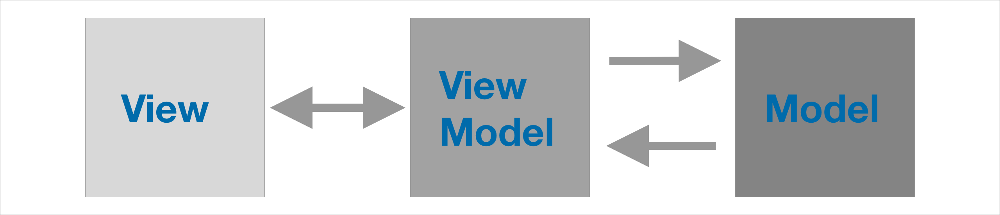

<h2> WhatsLeft?
  
  
</h2>

**WhatsLeft is an crowd-sourced solution to see what supermarkets have in stock.**

The iOS app uses SwiftUI and Combine and was written in less then 48 hours as part of [#WirvsVirusHack](https://wirvsvirushackathon.org), a hackathon organized by the german goverment to find solution to problems in the corona crisis.

You can vote for our project by liking the:

## Weitere Dokumentationen: 

- [Web App](https://github.com/WVV-Crowd-Sourced-Stock-Tracking/Web) 
- [Android App](https://github.com/WVV-Crowd-Sourced-Stock-Tracking/Android-App)
- [Rest Api / Backend](https://github.com/WVV-Crowd-Sourced-Stock-Tracking/Backend)
- [Rest Api / Python Backend](https://github.com/WVV-Crowd-Sourced-Stock-Tracking/Backend-python)

## Code Struktur der iOS / macOS app

Unsere app ist nach MVVM aufgebaut. Dabei findet die anbindung zum View Model über @ObserverdObjects statt. Dies ermöglicht uns nicht nur eine saubere trennung von Objekt Stukturen, Logik und View code sondern live updates der UI sobald neue daten vorliegen. 

### Struktur der Views

Die Views sind in zwei verschiedene Typen aufgeteilt. Einmal die Haupt Views und einmal die SubViews. 
SubViews auch Components genannt stellen hierbei Views da die ausschließlich in einer anderen View verwendet werden. Also Bei einer Liste ist die Liste die HauptView und die listen cell die SubView.

### Struktur der ViewModels

Die view Model spiegeln die HauptViews. Jede HauptView hat ein eigenes ViewModel, ausgenommen von dieser regel sind die Detail, Filter und Einkaufsliste View.

### Kommunitkation mit den Backend

Die kommunikation mit den backend findet über eien Rest API statt, diese wird durch das Framework Combinde ermöglicht. Combine erlaubt es uns asynchron die daten zu laden und anschließt durch ein ViewModel die View zu updaten. 

### MacOS app

Bei der MacOS app handelt es sich um eine Catalyst app. Catalyst ist ein framework welches es uns ermöglicht eine iOS app auf den mac laufen zu lassen, hierbei handelt es sich dennoch vor um eine native MacOS app. 

This projects is released under the MIT license.